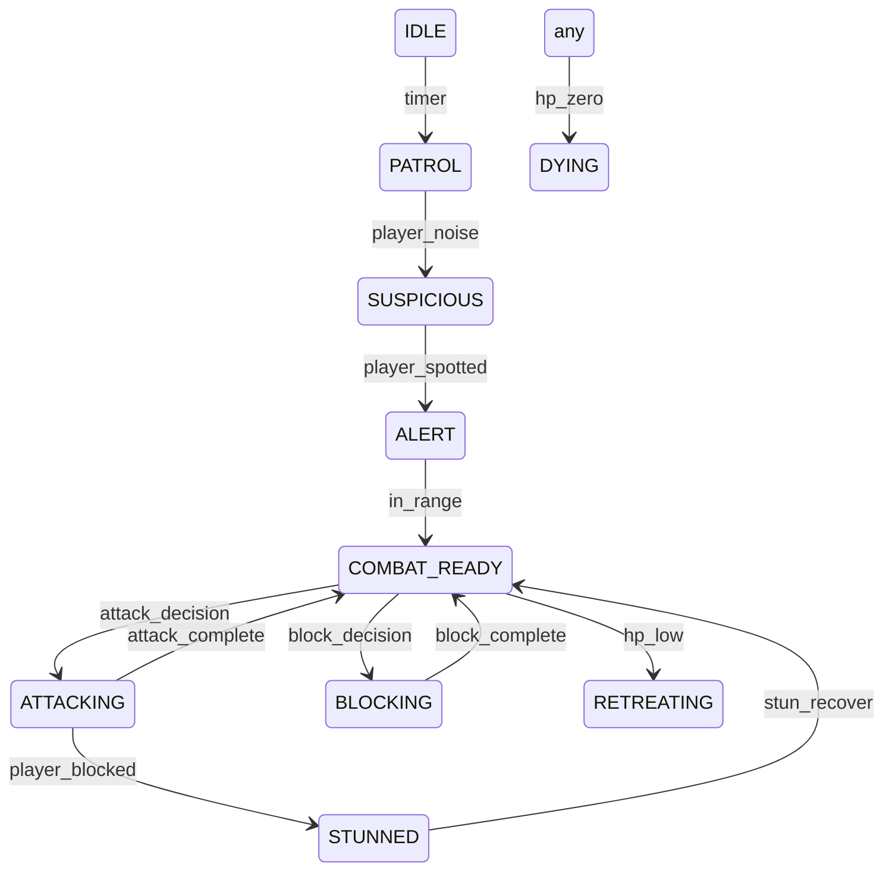

# Crystal Caverns - Ultimate Development Plan

> **Version**: 2.1 | **Status**: Phase 2 ~85% Complete → Phase 3 Final Polish
>
> This comprehensive document provides everything needed to transform Crystal Caverns from a working prototype into a **polished, engaging, commercially-viable** Prince of Persia-style platformer.
>
> **Last Updated**: February 2026

---

## Phase 2 Progress Summary

| Sprint | Status | Completion |
|--------|--------|------------|
| Sprint 2: Combat System | **COMPLETE** | 95% |
| Sprint 3: Visual Polish | In Progress | 60% |
| Sprint 4: Audio & Feel | In Progress | 65% |
| Sprint 5: Progression & Meta | Partial | 40% |
| Sprint 6: QA & Balance | Not Started | 0% |

### What's Been Implemented
- [x] Guard AI state machine with difficulty scaling
- [x] Captain mini-boss (Level 3) with door lock mechanic
- [x] Shadow Guardian final boss with 3 phases
- [x] Boss health bars with segmented display
- [x] Phase transition effects (screen flash, slowmo, banners)
- [x] Epic victory sequences with particles and slowmo
- [x] Comprehensive story system with 8 trigger types
- [x] Visual story elements (skeleton, inscription, crystal, journal, fallen seeker)
- [x] Dynamic tile_proximity triggers (stories follow tile placement)
- [x] Level editor with all tiles and game-accurate colors
- [x] Combat feel: screen shake, hit stop, particles
- [x] Basic procedural sound effects

### What Remains (See Phase 3)
- [ ] Parallax background system
- [ ] Dynamic torch lighting
- [ ] Music system with boss transitions
- [ ] Achievement system
- [ ] Leaderboards
- [ ] Full QA pass and balance tuning

---

## 📋 Executive Summary

**Goal**: Create a 10-15 minute gameplay experience that feels like a premium indie game with:

- Tight, responsive controls
- Satisfying sword combat with AI dueling
- Memorable boss encounters
- Atmospheric presentation
- High replayability through scoring and achievements

**Target Quality Bar**: Compares favorably to games like Dead Cells (combat feel), Celeste (tight controls), and Prince of Persia (animation philosophy).

---

## 🎮 Current State (MVP)

### What Works

| Component | Status | Quality |
|-----------|--------|---------|
| Movement | ✅ Complete | Functional - needs polish |
| Combat | ✅ Basic | Attacks/blocks work - AI is passive |
| 5 Levels | ✅ Designed | Sized 50-80 tiles - need playtesting |
| Timer | ✅ Working | Countdown + bonuses |

### Controls

| Key | Action |
|-----|--------|
| ← → / A D | Move left/right |
| ↑ / W | Jump |
| Shift | Toggle sword |
| Space | Attack |
| Ctrl | Block |

---

## 🗂️ Development Sprints

### Sprint 2: Combat System (Priority: HIGH)

### Sprint 3: Visual Polish (Priority: MEDIUM)

### Sprint 4: Audio & Feel (Priority: HIGH)

### Sprint 5: Progression & Meta (Priority: MEDIUM)

### Sprint 6: QA & Balance (Priority: HIGH)

---

# Sprint 2: Combat System

## 2.1 Guard AI State Machine

**File**: [Guard.ts](src/games/platform-adventure/entities/Guard.ts)

```typescript
enum GuardState {
  IDLE,           // Standing, occasional look-around
  PATROL,         // Walking set path
  SUSPICIOUS,     // Heard something, investigating
  ALERT,          // Sees player, approaches
  COMBAT_READY,   // In combat range, circling
  ATTACKING,      // Executing attack (0.4s locked)
  BLOCKING,       // Defensive stance (0.3s window)
  STUNNED,        // Hit stagger (0.5s recovery)
  RETREATING,     // Low HP, backing away
  DYING           // Death animation (1s)
}
```

### State Transitions



### Combat AI Decision Making

```typescript
interface CombatDecision {
  attackWeight: number;      // 0.0 - 1.0
  blockWeight: number;       // 0.0 - 1.0
  retreatWeight: number;     // 0.0 - 1.0
  advanceWeight: number;     // 0.0 - 1.0
}

function decideCombatAction(guard: Guard, player: Player): CombatDecision {
  const distToPlayer = Math.abs(player.x - guard.x);
  const healthPercent = guard.hp / guard.maxHp;
  const playerAttacking = player.state === 'attack';
  const reactionTime = guard.difficulty * 0.1; // 0.1s - 0.5s
  
  return {
    attackWeight: distToPlayer < 50 ? 0.6 : 0.2,
    blockWeight: playerAttacking ? 0.8 : 0.2,
    retreatWeight: healthPercent < 0.3 ? 0.7 : 0.1,
    advanceWeight: distToPlayer > 80 ? 0.5 : 0.1
  };
}
```

### Difficulty Scaling

| Guard Type | HP | Block Chance | Reaction Time | Aggression |
|------------|------|--------------|---------------|------------|
| Recruit | 1 | 20% | 500ms | Low |
| Soldier | 2 | 40% | 300ms | Medium |
| Veteran | 3 | 60% | 200ms | High |
| Captain | 5 | 70% | 150ms | Very High |
| Shadow Guardian | 10 | 80% | 100ms | Adaptive |

---

## 2.2 Mini-Boss: The Captain (Level 3)

**Encounter Design**: Guards the exit. Player must defeat to proceed.

### Stats

- **HP**: 5
- **Block Chance**: 50% base, 80% when player winds up
- **Damage**: 1 per hit
- **Speed**: 1.2x normal guard

### Special Abilities

```typescript
interface CaptainAbilities {
  doubleSwing: {
    trigger: 'hp < 60%',
    damage: 2,
    animation: 'two quick slashes',
    telegraph: 0.4s // time player has to react
  },
  shieldBash: {
    trigger: 'player blocked 3 times',
    effect: 'breaks player guard',
    followUp: 'guaranteed hit opportunity'
  },
  rallyCry: {
    trigger: 'hp < 30%',
    effect: 'increases aggression, reduces block chance',
    visual: 'red glow effect'
  }
}
```

### Combat Flow

1. **Phase 1 (HP 5-3)**: Standard combat, 50% block, tests player
2. **Phase 2 (HP 3-1)**: Uses Double Swing, more aggressive
3. **Phase 3 (HP 1)**: Rally Cry, all-out attack, low block

---

## 2.3 Final Boss: Shadow Guardian (Level 5)

**Encounter Design**: Multi-phase boss in dedicated arena near Golden Owl.

### Arena Layout

```
   ████████████████████████████████
   █                              █
   █      [SHADOW GUARDIAN]       █
   █           ████████           █
   █                              █
   █  ████              ████      █
   █                              █
   █     [PLAYER START]           █
   █  ████████████████████████    █
   ████████████████████████████████
```

### Phase Breakdown

#### Phase 1: "The Sentinel" (HP 10-7)

- **Behavior**: Defensive, patience-testing
- **Block Chance**: 70%
- **Pattern**: Block → Counter-attack
- **Player Strategy**: Wait for openings, don't spam attacks

#### Phase 2: "The Fury" (HP 6-3)

- **Behavior**: Aggressive, relentless
- **Block Chance**: 30% (prefers attacking)
- **Pattern**: 3-hit combo with short pauses
- **New Ability**: Charge Attack

  ```typescript
  chargeAttack: {
    telegraph: 1.0s,  // red glow, stepping back
    duration: 0.5s,   // lunges across arena
    damage: 2,
    dodgeable: true,  // jump over
    recovery: 0.8s    // vulnerable after
  }
  ```

- **Player Strategy**: Jump over charges, punish recovery

#### Phase 3: "Desperation" (HP 2-1)

- **Behavior**: Unpredictable, mixture
- **Block Chance**: 50%
- **New Ability**: Sword Spin

  ```typescript
  swordSpin: {
    telegraph: 0.6s,  // raises sword, spins weapon
    duration: 1.5s,   // spinning attack
    damage: 1,        // hits multiple times
    radius: 80px,
    dodgeable: true,  // perfect distance
    recovery: 1.0s    // very vulnerable
  }
  ```

- **Player Strategy**: Distance management, capitalize on spin recovery

### Victory Sequence

```typescript
onBossDefeat(): void {
  // Slow-mo death animation (2s)
  this.timeScale = 0.3;
  this.screenShake(15, 2.0);
  this.particles.createMassiveExplosion(boss.x, boss.y);
  
  // Door to Golden Owl opens
  setTimeout(() => {
    this.openSecretDoor();
    this.timeScale = 1.0;
    this.showBanner('THE PATH IS OPEN');
  }, 2000);
}
```

---

## 2.4 Combat Feel & Feedback

### Screen Shake

```typescript
class ScreenShake {
  shake(intensity: number, duration: number): void {
    // intensity: 1-20 pixels
    // duration: 0.1-1.0 seconds
    this.intensity = intensity;
    this.duration = duration;
    this.trauma = 1.0;
  }
  
  update(dt: number): void {
    this.trauma = Math.max(0, this.trauma - dt / this.duration);
    const shake = this.trauma * this.trauma; // Quadratic falloff
    this.offsetX = (Math.random() - 0.5) * shake * this.intensity;
    this.offsetY = (Math.random() - 0.5) * shake * this.intensity;
  }
}
```

### Hit Stop (Frame Freeze)

```typescript
onHitConnect(damage: number): void {
  // Freeze game for impact feel
  const hitStopDuration = damage * 0.03; // 30-60ms
  this.freezeFrame(hitStopDuration);
  
  // White flash on target
  this.flashEntity(target, '#ffffff', 0.1);
  
  // Particle burst
  this.particles.createSwordClash(hitX, hitY);
}
```

### Particle Effects

```typescript
interface ParticleConfig {
  swordClash: {
    count: 12,
    color: ['#ffffff', '#ffdd00'],
    velocity: 200,
    lifetime: 0.3,
    size: [2, 6]
  },
  blood: {
    count: 8,
    color: ['#ff0000', '#aa0000'],
    velocity: 150,
    lifetime: 0.5,
    size: [3, 8],
    gravity: 500
  },
  death: {
    count: 30,
    color: ['#880000', '#440000', '#220000'],
    velocity: 300,
    lifetime: 1.0,
    size: [5, 15]
  }
}
```

---

# Sprint 3: Visual Polish

## 3.1 Parallax Background System

```typescript
class ParallaxBackground {
  layers: BackgroundLayer[] = [
    {
      name: 'distant_cave',
      scrollFactor: 0.1,
      yOffset: 0,
      render: (ctx, camX, camY) => {
        // Deep blue cave silhouette
        this.drawCaveWall(ctx, camX * 0.1, camY * 0.1);
      }
    },
    {
      name: 'stalactites',
      scrollFactor: 0.3,
      yOffset: -50,
      render: (ctx, camX, camY) => {
        // Hanging rock formations
        this.drawStalactites(ctx, camX * 0.3, camY * 0.3);
      }
    },
    {
      name: 'chains',
      scrollFactor: 0.6,
      yOffset: 0,
      render: (ctx, camX, camY) => {
        // Foreground chains, cobwebs
        this.drawChains(ctx, camX * 0.6, camY * 0.6);
      }
    }
  ];
}
```

## 3.2 Dynamic Lighting

```typescript
class TorchLight {
  x: number;
  y: number;
  radius: number = 120;
  intensity: number = 1.0;
  flicker: number = 0;
  
  update(dt: number): void {
    // Natural flicker
    this.flicker += dt * 8;
    this.radius = 120 + Math.sin(this.flicker) * 10 + Math.random() * 5;
    this.intensity = 0.8 + Math.sin(this.flicker * 0.7) * 0.2;
  }
  
  render(ctx: CanvasRenderingContext2D): void {
    const gradient = ctx.createRadialGradient(
      this.x, this.y, 0,
      this.x, this.y, this.radius
    );
    gradient.addColorStop(0, `rgba(255, 150, 50, ${this.intensity * 0.4})`);
    gradient.addColorStop(0.5, `rgba(255, 100, 20, ${this.intensity * 0.2})`);
    gradient.addColorStop(1, 'transparent');
    
    ctx.globalCompositeOperation = 'lighter';
    ctx.fillStyle = gradient;
    ctx.fillRect(this.x - this.radius, this.y - this.radius, 
                 this.radius * 2, this.radius * 2);
    ctx.globalCompositeOperation = 'source-over';
  }
}
```

## 3.3 Enhanced Character Animation

### Animation Frame Specifications

```typescript
interface AnimationSet {
  idle: {
    frames: 4,
    duration: 2.0,  // slow breathing
    loop: true
  },
  walk: {
    frames: 6,
    duration: 0.6,
    loop: true
  },
  run: {
    frames: 8,
    duration: 0.4,
    loop: true
  },
  jump: {
    frames: 3,  // ascend, peak, descend
    duration: 'dynamic',
    loop: false
  },
  attack: {
    frames: 5,  // ready, wind, strike, hold, recover
    duration: 0.35,
    loop: false,
    hitFrame: 2  // damage on frame 2
  },
  block: {
    frames: 3,  // raise, hold, lower
    duration: 0.4,
    loop: false
  },
  hurt: {
    frames: 3,  // recoil, stagger, recover
    duration: 0.5,
    loop: false
  },
  death: {
    frames: 6,  // stumble, fall, collapse
    duration: 1.0,
    loop: false
  }
}
```

---

# Sprint 4: Audio & Game Feel

## 4.1 Sound Design

### Sound Categories

```typescript
interface SoundMap {
  // Movement
  'footstep_stone': { volume: 0.3, variations: 4 },
  'footstep_wood': { volume: 0.25, variations: 3 },
  'jump': { volume: 0.4, pitch: [0.9, 1.1] },
  'land': { volume: 0.5, pitch: [0.95, 1.05] },
  
  // Combat
  'sword_draw': { volume: 0.5 },
  'sword_sheathe': { volume: 0.4 },
  'sword_swing': { volume: 0.6, variations: 3 },
  'sword_hit': { volume: 0.8, variations: 2 },
  'sword_clash': { volume: 0.9 },  // blocked attack
  'hurt_grunt': { volume: 0.7, variations: 3 },
  'death_cry': { volume: 0.8 },
  
  // Environment
  'trap_activate': { volume: 0.6 },
  'spikes': { volume: 0.7 },
  'crumble': { volume: 0.5 },
  'switch_click': { volume: 0.4 },
  'gate_open': { volume: 0.6 },
  
  // Collectibles
  'gem_pickup': { volume: 0.5, pitch: [0.9, 1.3] },  // ascending pitch
  'health_restore': { volume: 0.6 },
  'time_bonus': { volume: 0.7 },
  
  // Music/Ambience
  'dungeon_ambience': { volume: 0.3, loop: true },
  'boss_music': { volume: 0.5, loop: true },
  'victory_fanfare': { volume: 0.8 }
}
```

## 4.2 Music System

```typescript
class MusicManager {
  currentTrack: string = 'dungeon_ambience';
  
  onBossApproach(): void {
    this.crossfade('dungeon_ambience', 'boss_intro', 2.0);
  }
  
  onBossFight(): void {
    this.play('boss_music');
  }
  
  onBossDefeat(): void {
    this.fadeOut('boss_music', 1.0);
    this.play('victory_fanfare');
  }
  
  onVictory(): void {
    this.play('victory_music');
  }
}
```

---

# Sprint 5: Progression & Meta

## 5.1 Scoring System

```typescript
interface ScoreBreakdown {
  // Base scoring
  gemValue: 100,
  timeValue: 10, // per second remaining
  
  // Multipliers
  speedBonus: {
    threshold: 60, // seconds
    multiplier: 2.0
  },
  noHitBonus: 500,
  
  // Combat
  guardKill: 200,
  captainKill: 500,
  bossKill: 2000,
  
  // Style points
  perfectBlock: 50,  // blocked at last moment
  counterAttack: 100  // hit after perfect block
}
```

## 5.2 Achievement System

```typescript
interface Achievement {
  id: string;
  name: string;
  description: string;
  condition: () => boolean;
  icon: string;
}

const ACHIEVEMENTS: Achievement[] = [
  // Progression
  { id: 'first_blood', name: 'First Blood', description: 'Defeat your first guard', icon: '⚔️' },
  { id: 'captain_slayer', name: 'Captain Slayer', description: 'Defeat the Captain', icon: '👑' },
  { id: 'shadow_slayer', name: 'Shadow Slayer', description: 'Defeat the Shadow Guardian', icon: '👁️' },
  { id: 'owl_finder', name: 'Owl Finder', description: 'Find the Golden Owl', icon: '🦉' },
  
  // Skill
  { id: 'flawless', name: 'Flawless', description: 'Complete a level without taking damage', icon: '💎' },
  { id: 'speedrunner', name: 'Speedrunner', description: 'Complete the game in under 8 minutes', icon: '⏱️' },
  { id: 'parry_master', name: 'Parry Master', description: 'Block 50 attacks', icon: '🛡️' },
  { id: 'no_sword', name: 'Pacifist', description: 'Complete Level 1 without drawing your sword', icon: '🕊️' },
  
  // Exploration
  { id: 'collector', name: 'Collector', description: 'Collect 100 gems total', icon: '💰' },
  { id: 'time_lord', name: 'Time Lord', description: 'Finish with over 60 seconds remaining', icon: '⏰' },
  { id: 'completionist', name: 'Completionist', description: 'Collect every gem in a level', icon: '🏆' }
];
```

## 5.3 Leaderboards (Local)

```typescript
interface LeaderboardEntry {
  name: string;
  score: number;
  time: number;  // seconds remaining
  deaths: number;
  date: number;  // timestamp
}

class Leaderboard {
  private key = 'crystal_caverns_scores';
  private maxEntries = 10;
  
  addScore(entry: LeaderboardEntry): number {
    const scores = this.getScores();
    scores.push(entry);
    scores.sort((a, b) => b.score - a.score);
    scores.splice(this.maxEntries);
    localStorage.setItem(this.key, JSON.stringify(scores));
    return scores.indexOf(entry) + 1; // Return rank
  }
}
```

---

# Sprint 6: QA & Balance

## 6.1 Playtesting Checklist

### Movement Feel

- [ ] Running feels responsive (< 50ms input lag)
- [ ] Jumping arc feels natural
- [ ] Landing has satisfying weight
- [ ] Edge detection works reliably

### Combat Balance

- [ ] Player can defeat guards without cheese strategies
- [ ] Blocking feels useful but not mandatory
- [ ] Attack timing has clear feedback
- [ ] Getting hit feels fair (telegraphed attacks)

### Boss Difficulty

- [ ] Captain beatable in 3-5 attempts for average player
- [ ] Shadow Guardian beatable in 5-10 attempts
- [ ] Both bosses have clear patterns to learn
- [ ] Both bosses feel epic and memorable

### Level Design

- [ ] Level 1 teaches all mechanics naturally
- [ ] No unfair trap placements
- [ ] Multiple approaches to challenges
- [ ] Secret areas feel rewarding

## 6.2 Performance Targets

| Metric | Target |
|--------|--------|
| Frame Rate | 60 FPS stable |
| Input Lag | < 50ms |
| Load Time | < 2s per level |
| Memory | < 100MB |

## 6.3 Bug Severity Categories

| Severity | Definition | Example |
|----------|------------|---------|
| Critical | Game-breaking | Softlock, crash |
| High | Progression blocked | Can't pass level |
| Medium | Gameplay affected | Damage not registering |
| Low | Visual/audio glitch | Animation pop |
| Cosmetic | Polish issue | Alignment off |

---

# 📁 Technical Reference

## Key Files

| File | Purpose | Lines |
|------|---------|-------|
| `PlatformGame.ts` | Main game loop | ~840 |
| `Player.ts` | Player entity | ~370 |
| `Guard.ts` | Enemy AI | ~300 |
| `LevelData.ts` | Level definitions | ~220 |
| `TileTypes.ts` | Tile system | ~50 |
| `Trap.ts` | Hazard logic | ~150 |
| `Collectible.ts` | Pickups | ~100 |

## Coding Standards

```typescript
// Use meaningful names
const ATTACK_DURATION = 0.35; // seconds

// Document complex logic
/**
 * Calculates guard's next action based on player state
 * @param guard - The guard making the decision
 * @param player - Current player state
 * @returns Next state for the guard
 */
function decideAction(guard: Guard, player: Player): GuardState

// Type everything
interface CombatResult {
  hit: boolean;
  damage: number;
  blocked: boolean;
  knockback: { x: number; y: number };
}
```

---

# 🚀 Quick Start

```bash
# Clone and install
git clone [repo]
cd hacktivate-nations-arcade
npm install

# Run development server
npm run dev

# Navigate to game
open http://localhost:3000/games/platform-adventure

# Type check
npm run type-check

# Build
npm run build
```

---

# ✅ Definition of Done

The game is complete when:

- [ ] All 5 levels are beatable without bugs
- [ ] Captain boss is challenging but fair
- [ ] Shadow Guardian provides epic finale
- [ ] Combat feels satisfying and responsive
- [ ] Visual polish exceeds prototype quality
- [ ] Sound design enhances immersion
- [ ] Score system encourages replay
- [ ] Achievement system rewards mastery
- [ ] Average playthrough: 10-15 minutes
- [ ] No Critical or High severity bugs

---

*Last Updated: January 2026*
*Document Version: 2.0*
